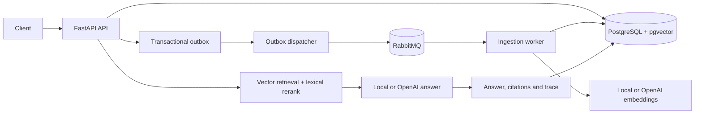

# EvidenceRAG architecture

## Consistency model

The API stores the document and its outbox event in one PostgreSQL transaction.
The dispatcher publishes durable messages with publisher confirms. The worker is
idempotent: a redelivered message for a ready document is acknowledged, while a
reprocessed document replaces its chunks in one transaction. Unhandled consumer
errors are routed to `rag.document.ingest.dlq`.

## Retrieval pipeline

1. Text is normalized and split with overlap.
2. Embeddings are generated in batches.
3. pgvector returns cosine-distance candidates.
4. A lexical-overlap signal reranks the candidates.
5. The answer prompt treats retrieved text as untrusted data and requires citations.
6. Query traces store prompt version, provider, latency and retrieved evidence.

The offline provider is intentionally deterministic: it makes the repository
fully testable without an API key. `LLM_PROVIDER=openai` enables an OpenAI-compatible
embedding and chat endpoint.

## Failure scenarios

- API crash before commit: neither the document nor event is visible.
- Dispatcher crash after publish: the event can be published again; worker processing is idempotent.
- Provider failure: document becomes `failed`, and the message is dead-lettered.
- Reused source key with new content: API returns `409 Conflict`.
- Missing evidence: answer explicitly reports insufficient data.

