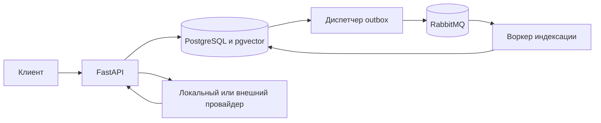

# Архитектура EvidenceRAG

## Владение и данные

API-ключ сопоставляется с идентификатором владельца из `API_KEYS`. Этот идентификатор хранится в базе знаний; доступ к документам, запросам и оценкам проверяется через неё. Отсутствие или недействительность ключа дают `401`, чужой объект — `404`. Ключи задаются в конфигурации и не сохраняются в базе. Такой способ годится для небольшого числа доверенных клиентов; ротация ключей, личные учётные записи и квоты потребуют отдельного контура управления доступом.

Создание документа и запись события outbox происходят в одной транзакции. Составной уникальный ключ `knowledge_base_id, source_key` и транзакционная блокировка для этого ключа устраняют гонку повторной загрузки. Другой текст или заголовок с прежним ключом отклоняется. При редактировании клиент передаёт номер поколения в `If-Match`; блокировка строки и проверка номера не позволяют тихо затереть параллельную редакцию.

Миграция 0002 назначает существующим базам владельца `legacy`. Администратор должен явно добавить этому владельцу ключ либо переназначить базы после проверки принадлежности. Обратная миграция запрещена, потому что она стёрла бы сведения о владельцах и поколениях.

## Доставка и индексация

Диспетчер выбирает неопубликованные события через `FOR UPDATE SKIP LOCKED` и отмечает их только после подтверждения RabbitMQ. Сбой после подтверждения и до фиксации БД вызывает повторную публикацию; это допустимо. PostgreSQL остаётся источником состояния задания: воркер периодически ищет документы, которым пора на индексацию, даже если уведомление пропало.

Воркер захватывает документ короткой транзакцией и сохраняет токен аренды, номер поколения и число попыток. Построение векторов происходит вне транзакции. Перед заменой фрагментов воркер повторно блокирует строку и сверяет токен с поколением. Если документ изменился или другой воркер забрал просроченную аренду, прежний результат отбрасывается. Ошибки провайдера ведут к повтору с ограниченной задержкой; после пяти попыток документ получает статус `failed`. Новая редакция сбрасывает счётчик и создаёт новое задание. Некорректные уведомления отклоняются без повторной доставки и попадают в очередь ошибок через настройки RabbitMQ.

Аренда длится 120 секунд по умолчанию. Долгая индексация может вызвать лишнюю повторную работу, но проверка токена предотвращает запись устаревших фрагментов. Если БД недоступна, завершить индексацию и сохранить ошибку невозможно; после восстановления задача станет доступна по истечении аренды.

## Поиск и ответы

Поиск объединяет наиболее подходящие фрагменты по косинусному расстоянию pgvector и полнотекстовому поиску PostgreSQL, затем применяет комбинированную оценку. Он видит лишь документы в состоянии `ready`, у которых поколение фрагмента и проиндексированное поколение совпадают с текущим. Пока идёт переиндексация новой редакции, документ из поиска исключён.

После вызова провайдера API заново проверяет поколения найденных документов под блокировкой строк, прежде чем сохранить историю ответа. Изменение источника во время генерации приводит к `409`. После возврата ответа документ, конечно, может быть изменён; цитата содержит поколение, чтобы потребитель мог проверить актуальность.

Локальный режим строит детерминированные хеш-векторы и отвечает фрагментом первого источника. Это средство для воспроизводимых тестов, а не оценка качества поиска или языковой модели. Внешний OpenAI-совместимый провайдер получает найденный текст как недоверенные данные и инструкцию цитировать источники. Приложение не может гарантировать, что сторонняя модель всегда последует этой инструкции; ответы требуют прикладной оценки.

История запроса хранит версию промпта, провайдера, цитаты и задержку. Метрики отражают число принятых документов, запросов и время ответа. Метрики не заменяют внешнее наблюдение за очередями, БД и провайдером.
